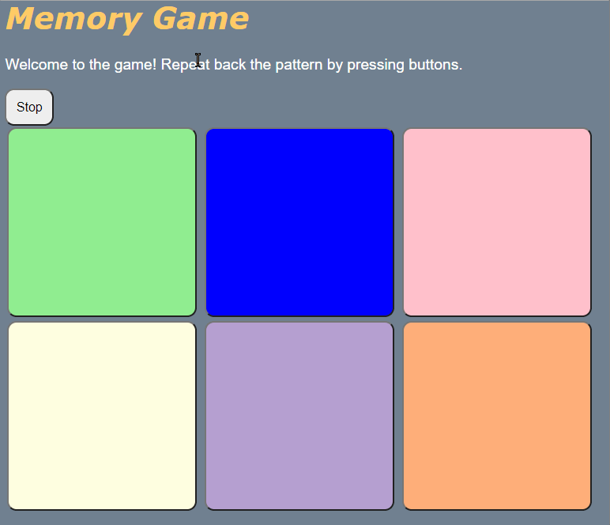

# Pre-work - **Memory Game**

**Memory Game** is a Light & Sound Memory game to apply for CodePath's SITE Program. 

Submitted by: **Rabiul Mazumder**

Time spent: **2** hours spent in total

## Required Functionality

The following **required** functionality is complete:

* [x] Game interface has a heading (h1 tag), a line of body text (p tag), and four buttons that match the demo app
* [x] "Start" button toggles between "Start" and "Stop" when clicked. 
* [x] Game buttons each light up and play a sound when clicked. 
* [x] Computer plays back sequence of clues including sound and visual cue for each button
* [x] Play progresses to the next turn (the user gets the next step in the pattern) after a correct guess. 
* [x] User wins the game after guessing a complete pattern
* [x] User loses the game after an incorrect guess

The following **optional** features are implemented:

* [x] Any HTML page elements (including game buttons) has been styled differently than in the tutorial
* [x] Buttons use a pitch (frequency) other than the ones in the tutorial
* [x] More than 4 functional game buttons
* [ ] Playback speeds up on each turn
* [ ] Computer picks a different pattern each time the game is played
* [ ] Player only loses after 3 mistakes (instead of on the first mistake)
* [ ] Game button appearance change goes beyond color (e.g. add an image)
* [ ] Game button sound is more complex than a single tone (e.g. an audio file, a chord, a sequence of multiple tones)
* [ ] User has a limited amount of time to enter their guess on each turn

The following **additional** features are implemented:

- [ ] List anything else that you can get done to improve the app!

## Video Walkthrough

Here's a walkthrough of implemented user stories:

(Gif is at an FPS of 8 that is why it appears like the button doesn't light up when clicked as the moment it lights up the LICEcap skips it)

## Reflection Questions
1. If you used any outside resources to help complete your submission (websites, books, people, etc) list them here. 
   These were sites I used to find the Color Hex Codes for the Header and 2 additional buttons
  - https://colorswall.com/palette/25148/
  - https://www.pinterest.com/pin/816699713653227113/
  - https://www.colorcombos.com/color-schemes/207/ColorCombo207.html

2. What was a challenge you encountered in creating this submission (be specific)? How did you overcome it? (recommended 200 - 400 words) 

    One of the challenges faced was with the Start and Stop button. When I would click Start it would transition to the Stop button but when pressing the button again it wouldn’t return back to the Start button it was still on Stop. Since it was a functionality issue I went to look at the script.js file to look at the two functions: startGame() and stopGame(). startGame looked right so I looked at stopGame() carefully and I realized that DOM of the “startBtn” and “stopBtn” the add and remove weren’t swapped. They needed to swapped because when using the stopGame() function when the button on “startBtn” should be hidden and removed but when on “stopBtn” it’’ be added then removed. Another challenge was when the colored buttons are supposed to light up when the sound occurs instead it was stuck on its preset colors when the sound played. Since this was an appearance issue it had to be the style.css file that needed an inspection. I looked at all the #button from 1 - 4 and all the #button.lit had different colors set to them so it is definitely supposed to change to those colors and didn’t have the same background color as the #button:activate. Looking closer the issue was the numbering of the buttons. Each #button has a number next to it to associate with the specific color button. The #button.lit I didn’t change the numbers associated with them so they all had #button1.lit instead of #button2.lit, #button3.lit, and #button4.lit. After fixing that the game was finally done.  

3. What questions about web development do you have after completing your submission? (recommended 100 - 300 words) 

The question that I have about web development that I have now is how much more can I do? What are the further possibilities the web development has? I made a Tip Calculator before and like this assignment I used JavaScript, CSS, and HTML to make these small projects. Even though I’ve coded a lot and made something cool this is essentially the basics of web development and now it just seems like the horizon is so far. I’m wondering what additional projects I could make using popular frameworks like Angular, React, Vue, etc. I’ve seen websites with amazing animations included in them and I wonder how they manage using it without slowing down the loading time. Make wacky sites like papertoilet.com where it’s just a screen with toilet paper and you keep pulling on it until the roll is empty.

4. If you had a few more hours to work on this project, what would you spend them doing (for example: refactoring certain functions, adding additional features, etc). Be specific. (recommended 100 - 300 words) 

Well, I did spend additional time adding more features to the game by adding two more buttons and changing the game’s secret pattern to accommodate them. Went to index.html added the buttons, went to style.css to change the colors for active and lit, went to script.js to include new pitch frequencies for the new buttons. If I had more hours to work on the project I would try to do the rest of the optional features to make the game more elaborate and engaging. Like speeding up the playback of each turn, use a random secret pattern, give the player 3 strikes, and add a ticking clock. I could also look up stuff online that could enhance the aesthetics of the project by making the buttons look more stylized and not have a simple background and text. Maybe even finding a way to make the sounds different and not use colors. Such as each button is a farm animal and each button made a sound associated with that animal. The cow button would go moo, the pig button would go oink, etc.

## License

    Copyright [Rabiul Mazumder]

    Licensed under the Apache License, Version 2.0 (the "License");
    you may not use this file except in compliance with the License.
    You may obtain a copy of the License at

        http://www.apache.org/licenses/LICENSE-2.0

    Unless required by applicable law or agreed to in writing, software
    distributed under the License is distributed on an "AS IS" BASIS,
    WITHOUT WARRANTIES OR CONDITIONS OF ANY KIND, either express or implied.
    See the License for the specific language governing permissions and
    limitations under the License.
